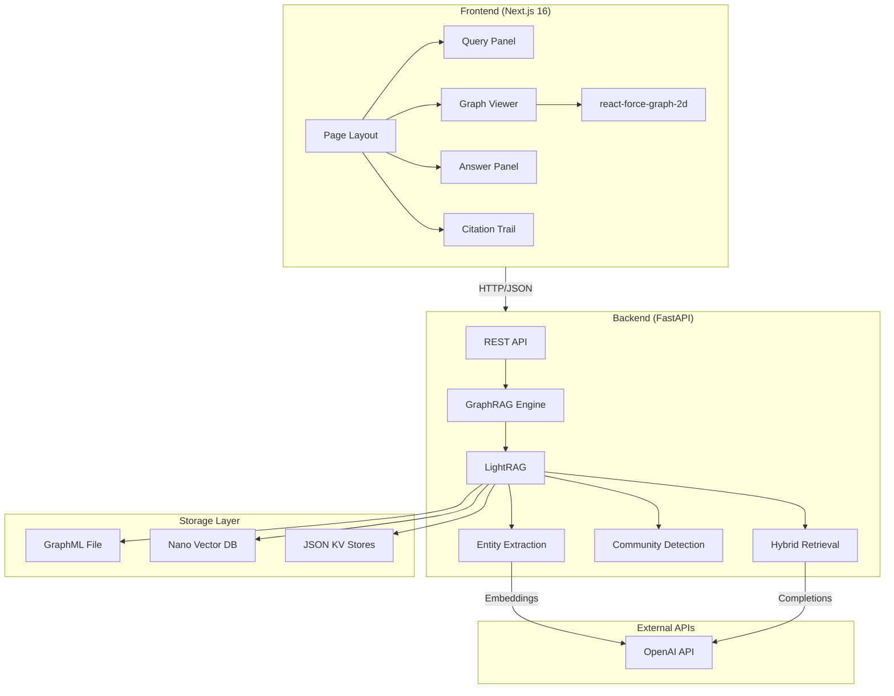
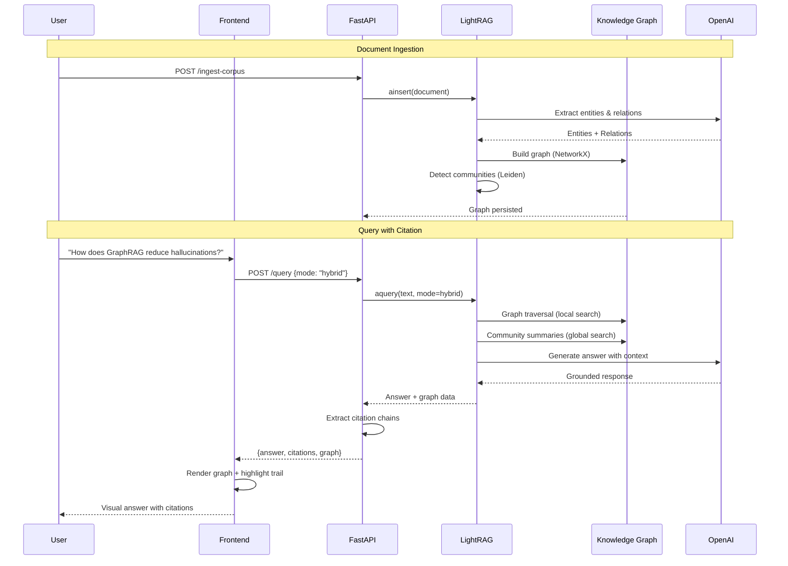
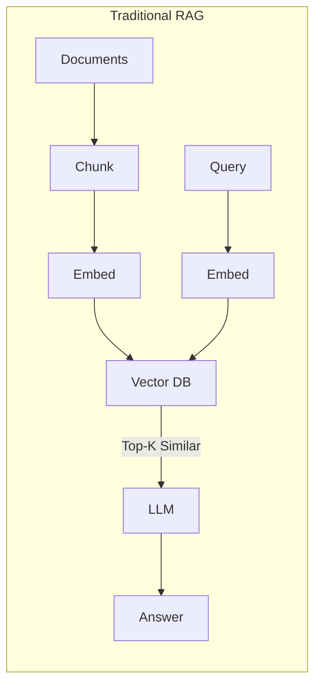
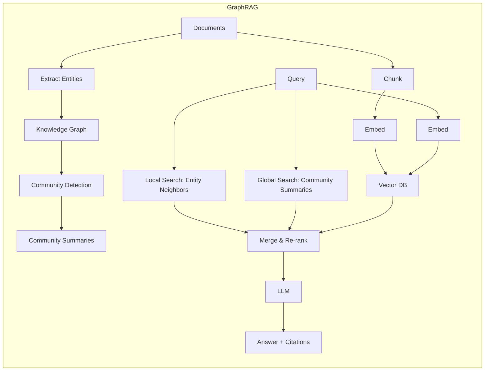

<p align="center">
  
</p>

<h1 align="center">TraceGraph</h1>

<p align="center">
  <strong>GraphRAG Citation Explorer</strong> — Trace every AI answer back to its source through the knowledge graph.
</p>

<p align="center">
  
  
  
  
  
  
  
</p>

<p align="center">
  <a href="#-quick-start">Quick Start</a> &bull;
  <a href="#-architecture">Architecture</a> &bull;
  <a href="#-features">Features</a> &bull;
  <a href="#-api-reference">API Reference</a> &bull;
  <a href="#-corpus">Corpus</a> &bull;
  <a href="#-deployment">Deployment</a>
</p>

---

## The Problem

Standard RAG retrieves document chunks via vector similarity — it finds text that _looks like_ the question. This works for simple lookups but fails catastrophically when questions require **connecting information across multiple documents**, understanding **entity relationships**, or providing **auditable citation trails**.

In regulated industries (healthcare, legal, finance), the EU AI Act mandates that AI systems provide **traceability** and **human oversight**. Vector RAG cannot satisfy these requirements.

## The Solution

TraceGraph demonstrates how **GraphRAG** (Graph-based Retrieval Augmented Generation) solves these problems by:

1. **Extracting a knowledge graph** from documents — entities, relationships, and community structures
2. **Querying with graph traversal** — following entity chains instead of relying on vector similarity alone
3. **Visualizing citation trails** — showing exactly which entities and relationships contributed to each answer
4. **Comparing approaches** — side-by-side naive RAG vs GraphRAG on the same query

---

## Screenshots

### Knowledge Graph Visualization (177 Entities, 124 Relations)

> Interactive force-directed graph showing entities extracted from a 12-document healthcare + AI corpus. Nodes are color-coded by type (concepts, technologies, organizations, regulations). Click any node to highlight its neighborhood.


### Query with Citation Trail

> Hybrid search result for "How does GraphRAG reduce hallucinations in enterprise AI?" showing the AI response with 10 traced citations, each linked to source documents and entity chains.


---

## Features

| Feature                         | Description                                                                                                         |
| ------------------------------- | ------------------------------------------------------------------------------------------------------------------- |
| **Interactive Knowledge Graph** | Force-directed 2D graph visualization with zoom, drag, and click-to-highlight. 200+ entities rendered at 60fps.     |
| **4 Search Modes**              | `hybrid` (graph + vector), `local` (entity-focused), `global` (community summaries), `naive` (vector-only baseline) |
| **Citation Trail**              | Every answer traces back through entity chains to source documents. Click a citation to see the graph path.         |
| **RAG vs GraphRAG Comparison**  | Side-by-side panel showing how naive vector RAG and GraphRAG answer the same question differently.                  |
| **Demo Mode**                   | Frontend works without a backend — ships with sample graph data for offline demos.                                  |
| **Entity Type Classification**  | Nodes classified as concepts, technologies, organizations, regulations, persons, or documents.                      |
| **Real-time API**               | FastAPI backend with async LightRAG integration, OpenAPI docs at `/docs`.                                           |

---

## Architecture



### Tech Stack

| Layer               | Technology                       | Purpose                                                 |
| ------------------- | -------------------------------- | ------------------------------------------------------- |
| **Frontend**        | Next.js 16, React 19, TypeScript | App shell, routing, SSR                                 |
| **Styling**         | Tailwind CSS 4                   | Design system with CSS variables                        |
| **Visualization**   | react-force-graph-2d             | Canvas-based force-directed graph                       |
| **Backend**         | FastAPI, Python 3.10+            | REST API, async request handling                        |
| **GraphRAG Engine** | LightRAG (HKUDS)                 | Entity extraction, graph construction, hybrid retrieval |
| **LLM**             | OpenAI GPT-4o-mini               | Entity extraction + query answering                     |
| **Embeddings**      | text-embedding-3-small           | Semantic vector search                                  |
| **Graph Storage**   | NetworkX + GraphML               | In-memory graph with file persistence                   |
| **Vector Storage**  | Nano Vector DB                   | Lightweight vector similarity search                    |

### Data Flow



---

## Quick Start

### Prerequisites

- Python 3.10+
- Node.js 20+
- OpenAI API key

### 1. Clone

```bash
git clone https://github.com/soneeee22000/tracegraph.git
cd tracegraph
```

### 2. Backend Setup

```bash
cd backend
cp .env.example .env
# Add your OpenAI API key to .env
```

```bash
pip install -r requirements.txt
```

### 3. Ingest the Corpus

```bash
python -c "
import asyncio
from app.graphrag import engine

async def ingest():
    await engine.initialize()
    results = await engine.ingest_corpus('./corpus')
    print(f'Ingested {len(results)} documents')

asyncio.run(ingest())
"
```

> This extracts ~177 entities and ~124 relationships from 12 documents. Takes 2-3 minutes, costs ~$0.15 in OpenAI API calls.

### 4. Start the Backend

```bash
python -m uvicorn app.main:app --host 0.0.0.0 --port 8000
```

### 5. Frontend Setup

```bash
cd ../frontend
npm install
npm run dev
```

### 6. Open

Visit **http://localhost:3000** — the graph loads automatically from the API.

> **Demo Mode:** The frontend works without a backend. It ships with sample data (24 entities, 29 relations) so you can explore the UI offline.

### Docker

```bash
cp backend/.env.example backend/.env
# Add your OpenAI API key to backend/.env
docker compose up
```

---

## API Reference

Base URL: `http://localhost:8000`

| Method | Endpoint         | Description                            | Body                           |
| ------ | ---------------- | -------------------------------------- | ------------------------------ |
| `GET`  | `/health`        | Service health + graph statistics      | —                              |
| `GET`  | `/graph`         | Full knowledge graph for visualization | —                              |
| `GET`  | `/docs`          | OpenAPI / Swagger interactive docs     | —                              |
| `POST` | `/query`         | Query with citation tracing            | `{query, mode, include_graph}` |
| `POST` | `/compare`       | Naive RAG vs GraphRAG side-by-side     | `{query}`                      |
| `POST` | `/ingest`        | Ingest a single document               | `{content, filename}`          |
| `POST` | `/ingest-corpus` | Ingest all `corpus/*.txt` files        | —                              |

### Example: Query

```bash
curl -X POST http://localhost:8000/query \
  -H "Content-Type: application/json" \
  -d '{"query": "How does GraphRAG reduce hallucinations?", "mode": "hybrid"}'
```

Response includes `answer`, `citations[]` (with entity chains and source documents), and `graph` (full node/edge data for visualization).

### Search Modes

| Mode     | Strategy                        | Best For                        |
| -------- | ------------------------------- | ------------------------------- |
| `hybrid` | Graph traversal + vector search | General questions (recommended) |
| `local`  | Entity neighborhood search      | Questions about specific topics |
| `global` | Community summary search        | Broad thematic questions        |
| `naive`  | Vector similarity only          | Baseline comparison             |

---

## Corpus

The `backend/corpus/` directory contains 12 curated documents spanning healthcare AI and GraphRAG infrastructure:

| #   | Document                        | Domain                 | Key Entities                                    |
| --- | ------------------------------- | ---------------------- | ----------------------------------------------- |
| 01  | GraphRAG Overview               | AI Infrastructure      | GraphRAG, Leiden Algorithm, Multi-hop Reasoning |
| 02  | Knowledge Graphs in Healthcare  | Healthcare AI          | UMLS, SNOMED CT, Clinical Decision Support      |
| 03  | Vaccine Safety Monitoring       | Pharmacovigilance      | VAERS, Brighton Collaboration, AEFI             |
| 04  | Entity Extraction & NLP         | Information Extraction | NER, Relation Extraction, Entity Resolution     |
| 05  | Citation-Grounded AI            | AI Safety              | FActScore, Citation Recall, Faithfulness        |
| 06  | Graph Databases for AI          | Database Technology    | Neo4j, LightRAG, FalkorDB                       |
| 07  | LLM Hallucination in Enterprise | Enterprise AI          | Deloitte Survey, Confidence Scoring             |
| 08  | Hybrid Retrieval Architectures  | Information Retrieval  | RRF, Cross-encoder Re-ranking                   |
| 09  | Community Detection             | Graph Algorithms       | Leiden, Louvain, Modularity                     |
| 10  | EU AI Act Compliance            | AI Regulation          | Article 13, Article 14, Traceability            |
| 11  | Clinical Trials Analysis        | Drug Development       | ClinicalTrials.gov, Pistoia Alliance            |
| 12  | AI Safety & Grounding           | Trustworthy AI         | HITL, Formal Verification                       |

After ingestion, the knowledge graph contains **~177 entities** across 6 types and **~124 relationships** connecting them.

---

## Project Structure

```
tracegraph/
├── backend/
│   ├── app/
│   │   ├── main.py            # FastAPI app, routes, CORS
│   │   ├── graphrag.py        # LightRAG engine wrapper
│   │   ├── models.py          # Pydantic request/response schemas
│   │   └── config.py          # Environment-based settings
│   ├── corpus/                # 12 source documents (.txt)
│   ├── graph_store/           # Generated: GraphML, vector DBs, KV stores
│   ├── requirements.txt
│   ├── Dockerfile
│   └── .env.example
├── frontend/
│   ├── src/
│   │   ├── app/
│   │   │   ├── layout.tsx     # Root layout with metadata
│   │   │   ├── page.tsx       # Main page (graph + panels)
│   │   │   └── globals.css    # Design system (CSS variables)
│   │   ├── components/
│   │   │   ├── graph-viewer.tsx       # Graph container + legend
│   │   │   ├── force-graph-canvas.tsx # Canvas-based force graph
│   │   │   ├── query-panel.tsx        # Search modes + input
│   │   │   ├── answer-panel.tsx       # AI response display
│   │   │   └── citation-trail.tsx     # Source provenance viewer
│   │   ├── lib/
│   │   │   ├── api.ts         # Backend API client
│   │   │   ├── graph-colors.ts # Entity type color mapping
│   │   │   └── sample-data.ts  # Demo mode graph data
│   │   └── types/
│   │       └── graph.ts       # TypeScript interfaces
│   ├── package.json
│   └── Dockerfile
├── docker-compose.yml
└── README.md
```

---

## How GraphRAG Works (for the curious)





**Key difference:** GraphRAG doesn't just find similar text — it traverses a structured knowledge graph to discover _related_ information across documents, then grounds the answer in verifiable entity chains.

---

## Configuration

### Environment Variables

| Variable              | Description                  | Default                     |
| --------------------- | ---------------------------- | --------------------------- |
| `LLM_MODEL`           | OpenAI model for completions | `gpt-4o-mini`               |
| `LLM_API_KEY`         | OpenAI API key               | _required_                  |
| `LLM_API_BASE`        | OpenAI API base URL          | `https://api.openai.com/v1` |
| `EMBEDDING_MODEL`     | Embedding model              | `text-embedding-3-small`    |
| `EMBEDDING_API_KEY`   | Embedding API key            | _required_                  |
| `EMBEDDING_API_BASE`  | Embedding API base URL       | `https://api.openai.com/v1` |
| `WORKING_DIR`         | Graph storage directory      | `./graph_store`             |
| `CORPUS_DIR`          | Document corpus directory    | `./corpus`                  |
| `CORS_ORIGINS`        | Allowed CORS origins         | `http://localhost:3000`     |
| `NEXT_PUBLIC_API_URL` | Backend URL (frontend)       | `http://localhost:8000`     |

---

## Deployment

### Vercel (Frontend)

```bash
cd frontend
npx vercel --prod
```

Set `NEXT_PUBLIC_API_URL` to your backend URL in Vercel environment variables.

### Railway (Backend)

```bash
cd backend
railway up
```

Set all environment variables in the Railway dashboard.

### Docker Compose (Self-hosted)

```bash
docker compose up -d
```

---

## Security

- API keys are stored in `.env` files (gitignored, never committed)
- CORS is configured to allow only specified origins
- No authentication layer (add your own for production)
- Input validation on all API endpoints via Pydantic
- No raw SQL — all data access through LightRAG's storage layer

---

## Performance

| Metric                   | Value                        |
| ------------------------ | ---------------------------- |
| Corpus size              | 12 documents (~15,000 words) |
| Entities extracted       | 177                          |
| Relationships extracted  | 124                          |
| Ingestion time           | ~2-3 minutes                 |
| Ingestion cost           | ~$0.15 (OpenAI API)          |
| Query latency (hybrid)   | ~3-8 seconds                 |
| Frontend build           | < 4 seconds                  |
| Graph render (177 nodes) | 60fps on modern hardware     |

---

## License

MIT License. See [LICENSE](LICENSE) for details.

---

<p align="center">
  Built with <a href="https://github.com/HKUDS/LightRAG">LightRAG</a> &bull;
  <a href="https://nextjs.org">Next.js</a> &bull;
  <a href="https://fastapi.tiangolo.com">FastAPI</a> &bull;
  <a href="https://github.com/vasturiano/react-force-graph">react-force-graph</a>
</p>
