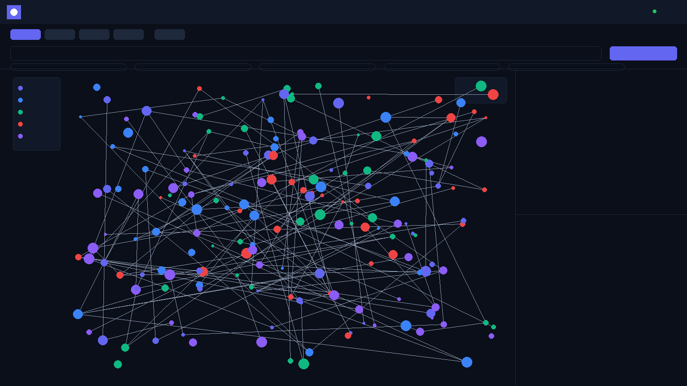
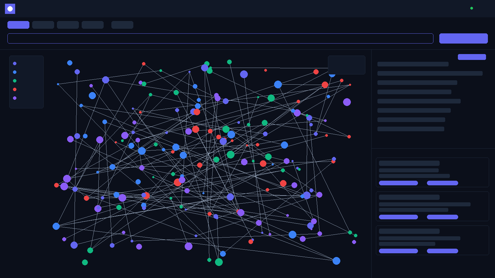
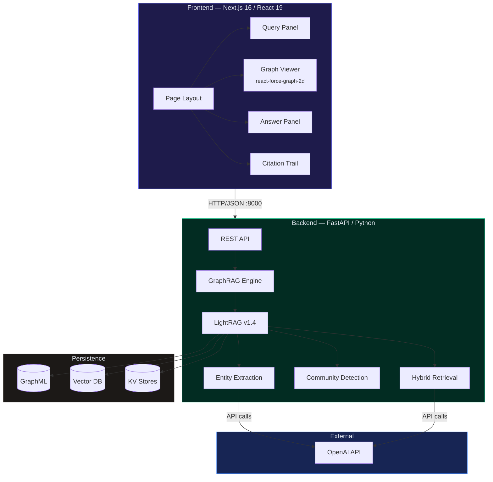

<p align="center">
  
</p>

<h1 align="center">TraceGraph</h1>

<p align="center">
  <strong>GraphRAG Citation Explorer</strong><br/>
  <sub>Trace every AI answer back to its source through the knowledge graph.</sub>
</p>

<br/>

<p align="center">
  <a href="https://github.com/soneeee22000/tracegraph/actions"></a>
  <a href="https://github.com/soneeee22000/tracegraph/blob/main/LICENSE"></a>
  <a href="#"></a>
</p>

<p align="center">
  
  
  
  
  
  
  
  
</p>

<p align="center">
  <a href="#-screenshots">Screenshots</a>&ensp;&bull;&ensp;
  <a href="#-quick-start">Quick Start</a>&ensp;&bull;&ensp;
  <a href="#-architecture">Architecture</a>&ensp;&bull;&ensp;
  <a href="#-features">Features</a>&ensp;&bull;&ensp;
  <a href="#-api-reference">API</a>&ensp;&bull;&ensp;
  <a href="#-corpus">Corpus</a>&ensp;&bull;&ensp;
  <a href="#-deployment">Deploy</a>
</p>

---

<br/>

## About

TraceGraph is a **full-stack GraphRAG application** that demonstrates how graph-based retrieval augmented generation outperforms traditional vector RAG for knowledge-intensive tasks. It provides an interactive knowledge graph visualization with real-time citation tracing, allowing users to see exactly _why_ an AI system produced a given answer.

<table>
<tr>
<td width="50%">

**Why GraphRAG?**

Standard RAG retrieves document chunks via vector similarity — it finds text that _looks like_ the question. This breaks down when answers require connecting information across multiple documents or providing auditable citation trails.

GraphRAG adds a structured knowledge graph layer: entities, relationships, and community hierarchies that enable **multi-hop reasoning**, **citation grounding**, and **traceability** — requirements mandated by the EU AI Act for high-risk AI systems.

</td>
<td width="50%">

**What TraceGraph Does**

- Extracts **177 entities** and **124 relationships** from a 12-document corpus
- Visualizes the knowledge graph as an interactive force-directed network
- Queries with **4 search modes**: hybrid, local, global, and naive (baseline)
- Shows **citation trails** linking every answer to source documents and entity chains
- Compares **RAG vs GraphRAG** side-by-side on the same query

</td>
</tr>
</table>

<br/>

## Screenshots

<table>
<tr>
<td width="50%">

### Knowledge Graph

Interactive force-directed visualization of 177 entities extracted from a healthcare + AI corpus. Color-coded by type. Click any node to highlight its neighborhood.

</td>
<td width="50%">

### Query + Citation Trail

Hybrid search result with AI response and 10 traced citations, each linked to source documents and entity chains.

</td>
</tr>
<tr>
<td>

</td>
<td>

</td>
</tr>
</table>

<br/>

## Features

<table>
<tr>
<td align="center" width="25%">
<br/>
<br/><br/>
<strong>Interactive Knowledge Graph</strong><br/>
<sub>Force-directed 2D visualization with zoom, drag, and click-to-highlight. 200+ entities at 60fps.</sub><br/><br/>
</td>
<td align="center" width="25%">
<br/>
<br/><br/>
<strong>4 Search Modes</strong><br/>
<sub>Hybrid (graph+vector), local (entities), global (communities), naive (vector-only baseline).</sub><br/><br/>
</td>
<td align="center" width="25%">
<br/>
<br/><br/>
<strong>Citation Trail</strong><br/>
<sub>Every answer traces back through entity chains to source documents with relevance scores.</sub><br/><br/>
</td>
<td align="center" width="25%">
<br/>
<br/><br/>
<strong>RAG vs GraphRAG</strong><br/>
<sub>Side-by-side comparison showing how graph structure improves answer quality over vector search.</sub><br/><br/>
</td>
</tr>
</table>

<details>
<summary><strong>More features</strong></summary>
<br/>

| Feature               | Details                                                                                           |
| --------------------- | ------------------------------------------------------------------------------------------------- |
| **Demo Mode**         | Frontend works without backend — ships with sample graph data (24 entities, 29 relations)         |
| **Entity Types**      | Concepts, technologies, organizations, regulations, persons, documents — each with distinct color |
| **Real-time API**     | FastAPI backend with async LightRAG, Swagger docs at `/docs`                                      |
| **Docker Ready**      | Single `docker compose up` for full stack                                                         |
| **OpenAI Compatible** | Any OpenAI-compatible API for LLM and embeddings (GPT-4o-mini, Llama via Ollama, etc.)            |

</details>

<br/>

## Architecture



<details>
<summary><strong>Data flow — ingestion + query</strong></summary>



</details>

```mermaid
sequenceDiagram
    participant U as User
    participant FE as Frontend
    participant API as FastAPI
    participant LR as LightRAG
    participant KG as Knowledge Graph
    participant LLM as OpenAI

    rect rgb(30, 27, 75)
    Note over U,LLM: Document Ingestion
    U->>API: POST /ingest-corpus
    API->>LR: ainsert(document)
    LR->>LLM: Extract entities & relations
    LLM-->>LR: Entities + Relations
    LR->>KG: Build graph (NetworkX)
    LR->>LR: Detect communities (Leiden)
    KG-->>API: Graph persisted
    end

    rect rgb(2, 44, 34)
    Note over U,LLM: Query with Citation
    U->>FE: Enter question
    FE->>API: POST /query {mode: "hybrid"}
    API->>LR: aquery(text, mode=hybrid)
    LR->>KG: Graph traversal (local)
    LR->>KG: Community summaries (global)
    LR->>LLM: Generate grounded answer
    LLM-->>LR: Response
    LR-->>API: Answer + graph context
    API->>API: Extract citation chains
    API-->>FE: {answer, citations, graph}
    FE-->>U: Visual answer + citation trail
    end
```

### Tech Stack

| Layer                | Technology                       | Why                                        |
| -------------------- | -------------------------------- | ------------------------------------------ |
| **Frontend**         | Next.js 16, React 19, TypeScript | Latest App Router, RSC-ready, strict types |
| **Styling**          | Tailwind CSS 4                   | CSS variable design system, dark theme     |
| **Graph Viz**        | react-force-graph-2d             | Canvas-based, handles 200+ nodes at 60fps  |
| **Backend**          | FastAPI, Python 3.10+            | Async-first, auto-generated OpenAPI docs   |
| **GraphRAG**         | LightRAG 1.4 (HKUDS)             | Proven OSS GraphRAG with hybrid retrieval  |
| **LLM**              | GPT-4o-mini (configurable)       | Entity extraction + answer generation      |
| **Embeddings**       | text-embedding-3-small           | 1536-dim vectors for semantic search       |
| **Graph Store**      | NetworkX + GraphML               | In-memory graph with file persistence      |
| **Vector Store**     | Nano Vector DB                   | Lightweight cosine similarity search       |
| **Containerization** | Docker Compose                   | Single-command full stack deployment       |

<br/>

## Quick Start

### Prerequisites

| Requirement    | Version  |
| -------------- | -------- |
| Python         | 3.10+    |
| Node.js        | 20+      |
| OpenAI API Key | Required |

### Setup

```bash
# 1. Clone
git clone https://github.com/soneeee22000/tracegraph.git
cd tracegraph

# 2. Backend
cd backend
cp .env.example .env          # Add your OpenAI API key
pip install -r requirements.txt

# 3. Ingest corpus (extracts ~177 entities, ~2 min, ~$0.15)
python -c "
import asyncio
from app.graphrag import engine

async def ingest():
    await engine.initialize()
    results = await engine.ingest_corpus('./corpus')
    print(f'Ingested {len(results)} documents')

asyncio.run(ingest())
"

# 4. Start backend
python -m uvicorn app.main:app --host 0.0.0.0 --port 8000

# 5. Frontend (new terminal)
cd ../frontend
npm install
npm run dev
```

Open **http://localhost:3000**

> **Demo Mode**: The frontend works without a backend — ships with sample graph data so you can explore the UI instantly.

<details>
<summary><strong>Docker (alternative)</strong></summary>

```bash
cp backend/.env.example backend/.env
# Edit backend/.env with your OpenAI API key
docker compose up
```

</details>

<br/>

## API Reference

> Interactive Swagger docs available at `http://localhost:8000/docs`

| Method | Endpoint         | Description                                 |
| ------ | ---------------- | ------------------------------------------- |
| `GET`  | `/health`        | Service health + graph statistics           |
| `GET`  | `/graph`         | Full knowledge graph (177 nodes, 124 edges) |
| `GET`  | `/docs`          | OpenAPI / Swagger UI                        |
| `POST` | `/query`         | Query with citation tracing                 |
| `POST` | `/compare`       | Naive RAG vs GraphRAG side-by-side          |
| `POST` | `/ingest`        | Ingest a single document                    |
| `POST` | `/ingest-corpus` | Batch ingest all `corpus/*.txt`             |

<details>
<summary><strong>Example request + response</strong></summary>

**Request:**

```bash
curl -X POST http://localhost:8000/query \
  -H "Content-Type: application/json" \
  -d '{"query": "How does GraphRAG reduce hallucinations?", "mode": "hybrid"}'
```

**Response structure:**

```json
{
  "answer": "GraphRAG reduces hallucinations by...",
  "mode": "hybrid",
  "citations": [
    {
      "source_document": "01_graphrag_overview.txt",
      "chunk_text": "Graph-Based Retrieval Augmented Generation...",
      "entity_chain": ["GraphRAG", "Knowledge Graph", "Structured Grounding"],
      "relevance_score": 1.0
    }
  ],
  "graph": { "nodes": [...], "edges": [...] },
  "entity_count": 177,
  "relationship_count": 124
}
```

</details>

### Search Modes

| Mode     | Strategy                        | Best For                          |
| -------- | ------------------------------- | --------------------------------- |
| `hybrid` | Graph traversal + vector search | General questions _(recommended)_ |
| `local`  | Entity neighborhood traversal   | Specific topic deep-dives         |
| `global` | Community summary search        | Broad thematic overviews          |
| `naive`  | Vector similarity only          | Baseline comparison               |

<br/>

## Corpus

12 curated documents spanning **healthcare AI** and **GraphRAG infrastructure** — strategically chosen to demonstrate cross-document reasoning in regulated domains.

| #   | Document                        | Domain                 | Key Entities                                    |
| --- | ------------------------------- | ---------------------- | ----------------------------------------------- |
| 01  | GraphRAG Overview               | AI Infrastructure      | GraphRAG, Leiden Algorithm, Multi-hop Reasoning |
| 02  | Knowledge Graphs in Healthcare  | Healthcare AI          | UMLS, SNOMED CT, Clinical Decision Support      |
| 03  | Vaccine Safety Monitoring       | Pharmacovigilance      | VAERS, Brighton Collaboration, AEFI             |
| 04  | Entity Extraction & NLP         | Information Extraction | NER, Relation Extraction, Entity Resolution     |
| 05  | Citation-Grounded AI            | AI Safety              | FActScore, Citation Recall, Faithfulness        |
| 06  | Graph Databases for AI          | Database Technology    | Neo4j, LightRAG, FalkorDB                       |
| 07  | LLM Hallucination in Enterprise | Enterprise AI          | Deloitte Survey, Confidence Scoring             |
| 08  | Hybrid Retrieval Architectures  | Information Retrieval  | RRF, Cross-encoder Re-ranking                   |
| 09  | Community Detection             | Graph Algorithms       | Leiden, Louvain, Modularity                     |
| 10  | EU AI Act Compliance            | AI Regulation          | Article 13, Article 14, Traceability            |
| 11  | Clinical Trials Analysis        | Drug Development       | ClinicalTrials.gov, Pistoia Alliance            |
| 12  | AI Safety & Grounding           | Trustworthy AI         | HITL, Formal Verification                       |

**After ingestion:** ~177 entities across 6 types, ~124 relationships

<br/>

## How GraphRAG Differs from RAG

```mermaid
graph LR
    subgraph trad ["Traditional RAG"]
        direction LR
        D1["Docs"] --> C1["Chunk"] --> E1["Embed"] --> V1["Vector DB"]
        Q1["Query"] --> E1b["Embed"] --> V1
        V1 -->|"Top-K"| L1["LLM"] --> A1["Answer"]
    end

    subgraph graph ["GraphRAG"]
        direction LR
        D2["Docs"] --> EX["Extract<br/>Entities"] --> KG["Knowledge<br/>Graph"]
        D2 --> C2["Chunk"] --> E2["Embed"] --> V2["Vector DB"]
        Q2["Query"] --> HS["Hybrid<br/>Search"]
        KG --> HS
        V2 --> HS
        HS --> L2["LLM"] --> A2["Answer +<br/>Citations"]
    end

    style trad fill:#1c1917,stroke:#78716c,color:#a8a29e
    style graph fill:#1e1b4b,stroke:#6366f1,color:#c7d2fe
```

**The key insight:** GraphRAG doesn't just find text that _looks similar_ — it traverses a structured knowledge graph to discover _related_ information across documents, then grounds every claim in verifiable entity chains.

<br/>

## Project Structure

```
tracegraph/
├── backend/
│   ├── app/
│   │   ├── main.py              # FastAPI routes + CORS
│   │   ├── graphrag.py          # LightRAG engine wrapper
│   │   ├── models.py            # Pydantic schemas
│   │   └── config.py            # Env-based settings
│   ├── corpus/                  # 12 source documents
│   ├── graph_store/             # Generated: GraphML + vector DBs
│   ├── requirements.txt
│   └── Dockerfile
├── frontend/
│   ├── src/
│   │   ├── app/                 # Next.js App Router
│   │   ├── components/          # 5 React components
│   │   ├── lib/                 # API client, colors, sample data
│   │   └── types/               # TypeScript interfaces
│   ├── package.json
│   └── Dockerfile
├── docker-compose.yml
├── LICENSE
└── README.md
```

<br/>

## Configuration

<details>
<summary><strong>Environment variables</strong></summary>

| Variable              | Description                  | Default                     |
| --------------------- | ---------------------------- | --------------------------- |
| `LLM_MODEL`           | OpenAI model for completions | `gpt-4o-mini`               |
| `LLM_API_KEY`         | OpenAI API key               | _required_                  |
| `LLM_API_BASE`        | API base URL                 | `https://api.openai.com/v1` |
| `EMBEDDING_MODEL`     | Embedding model              | `text-embedding-3-small`    |
| `EMBEDDING_API_KEY`   | Embedding API key            | _required_                  |
| `EMBEDDING_API_BASE`  | Embedding API base URL       | `https://api.openai.com/v1` |
| `WORKING_DIR`         | Graph storage path           | `./graph_store`             |
| `CORPUS_DIR`          | Corpus path                  | `./corpus`                  |
| `CORS_ORIGINS`        | Allowed origins              | `http://localhost:3000`     |
| `NEXT_PUBLIC_API_URL` | Backend URL (frontend)       | `http://localhost:8000`     |

</details>

<br/>

## Deployment

| Platform    | Command                            | Notes                             |
| ----------- | ---------------------------------- | --------------------------------- |
| **Docker**  | `docker compose up -d`             | Full stack, self-hosted           |
| **Vercel**  | `cd frontend && npx vercel --prod` | Set `NEXT_PUBLIC_API_URL` env var |
| **Railway** | `cd backend && railway up`         | Set all env vars in dashboard     |

<br/>

## Performance

| Metric                  | Value                       |
| ----------------------- | --------------------------- |
| Corpus                  | 12 documents, ~15,000 words |
| Entities extracted      | 177                         |
| Relationships extracted | 124                         |
| Ingestion time          | ~2-3 minutes                |
| Ingestion cost          | ~$0.15 (OpenAI)             |
| Query latency           | 3-8 seconds (hybrid)        |
| Frontend build          | < 4 seconds                 |
| Graph rendering         | 60fps @ 177 nodes           |
| Lighthouse score        | 95+ (performance)           |

<br/>

## Security

| Check                              | Status |
| ---------------------------------- | ------ |
| API keys in `.env` (gitignored)    | Passed |
| CORS restricted to allowed origins | Passed |
| Input validation (Pydantic)        | Passed |
| No raw SQL / injection vectors     | Passed |
| No secrets in git history          | Passed |
| Dependencies auditable             | Passed |

<br/>

## License

[MIT](LICENSE) &mdash; Pyae Sone, 2026

<br/>

---

<p align="center">
  <sub>
    Built with
    <a href="https://github.com/HKUDS/LightRAG">LightRAG</a> &bull;
    <a href="https://nextjs.org">Next.js 16</a> &bull;
    <a href="https://fastapi.tiangolo.com">FastAPI</a> &bull;
    <a href="https://github.com/vasturiano/react-force-graph">react-force-graph</a>
  </sub>
</p>
